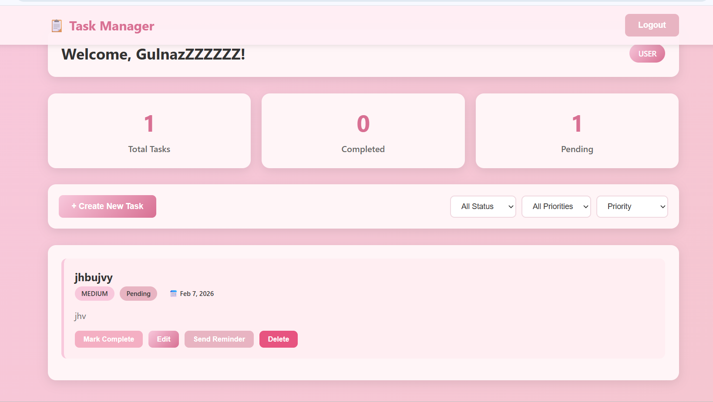
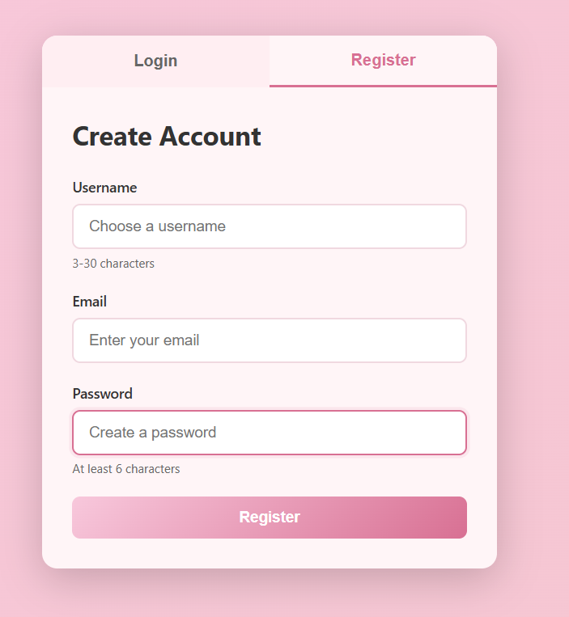
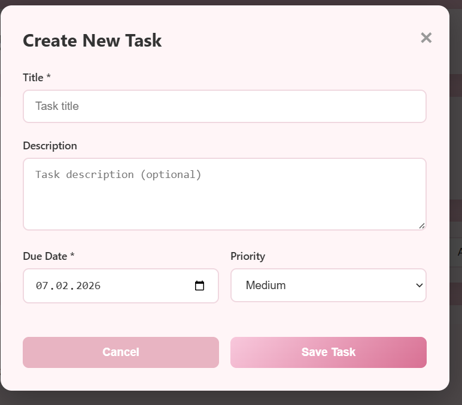

# TaskManager - Final Project

## Project Overview
TaskManager is a full-stack web application developed as a final project.
The application allows users to register, authenticate, and manage their personal tasks.
The backend is built with Node.js and Express, uses MongoDB Atlas for data storage, and implements secure authentication using JWT and role-based access control.

## Technologies Used
- Node.js
- Express.js
- MongoDB Atlas
- Mongoose
- JSON Web Token (JWT)
- bcrypt
- HTML, CSS, JavaScript
- Render (deployment)

## Project Structure
TaskManager/
controllers/
routes/
models/
middleware/
public/
views/
server.js
package.json
README.md
screenshots/

The project follows a modular structure with separate files for controllers, routes, models, and middleware.

## Setup Instructions
1. Clone the repository:
git clone https://github.com/zhannur17/TaskManager.git

2. Install dependencies:
npm install

3. Create a .env file and add:
MONGODB_URI=your_mongodb_atlas_uri
JWT_SECRET=your_jwt_secret

4. Run the project locally:
npm start

## Database
The project uses MongoDB Atlas as a cloud database.
Two collections are implemented:
User (username, email, password, role)
Task (title, description, status, user reference)

## Authentication and Security
Passwords are hashed using bcrypt.
Authentication is implemented using JWT.
Protected routes require a valid token.
Sensitive configuration is stored in environment variables.

## Role-Based Access Control
User can create, view, update, and delete only their own tasks.
Admin has extended permissions, such as deleting any task.

RBAC is implemented using middleware.

## API Endpoints

Authentication (Public)
POST /api/auth/register  
POST /api/auth/login  

User Management (Private)
GET /api/users/profile  
PUT /api/users/profile  

Task Management (Private)
POST /api/tasks  
GET /api/tasks  
GET /api/tasks/:id  
PUT /api/tasks/:id  
DELETE /api/tasks/:id  

## Deployment
The project is deployed using Render.
Environment variables are securely stored using Render environment settings.

Deployed Project URL:
[https://taskmanager-wolm.onrender.com](https://taskmanager-wolm.onrender.com)

## Screenshots and Feature Description

### User Registration

This screenshot demonstrates the user registration functionality, where a new user creates an account by providing required credentials.

## Screenshots and Feature Description

### Task List

This screenshot shows the list of tasks belonging to the logged-in user.

---

### Create Task

This screenshot demonstrates how an authenticated user creates a new task.

---

### Login

This screenshot shows the user login process and successful authentication.

---

### Register

This screenshot demonstrates the user registration functionality.

## Final Notes
This project was developed as a final exam project and demonstrates RESTful API design, authentication, authorization, database integration, and deployment.
